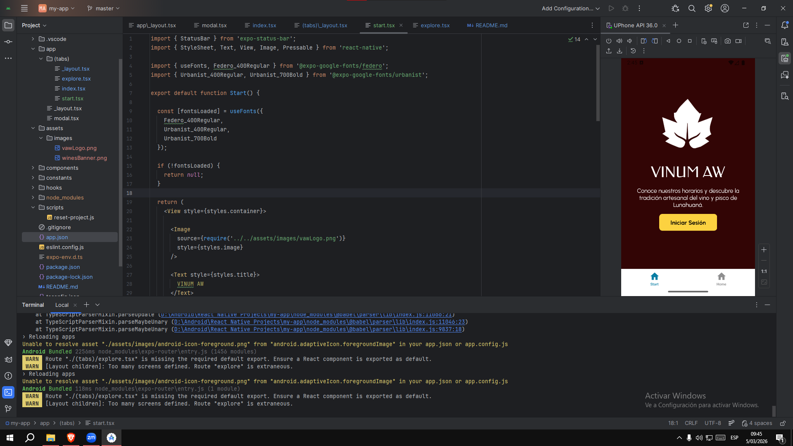

# VINUM AW

Consiste en un proyecto software de Plataforma Web para la empresa Vitivinícola y Enoturística Bodega Reyna de Lunahuaná.

En el presente, se está desarrollando una aplicación móvil desarrollada con React Native y Expo que permite a los usuarios conocer la bodega, revisar productos y visualizar información del destino turístico.

## Comandos de Despliegue de Prueba

1. Instalar dependencias

   ```bash
   npm install
   ```

2. Iniciar la app

   ```bash
   npx expo start
   ```
### Resultado de Ejecución


